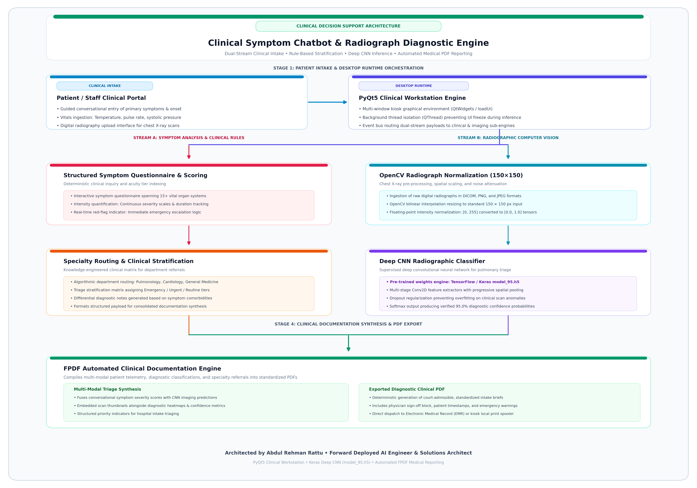
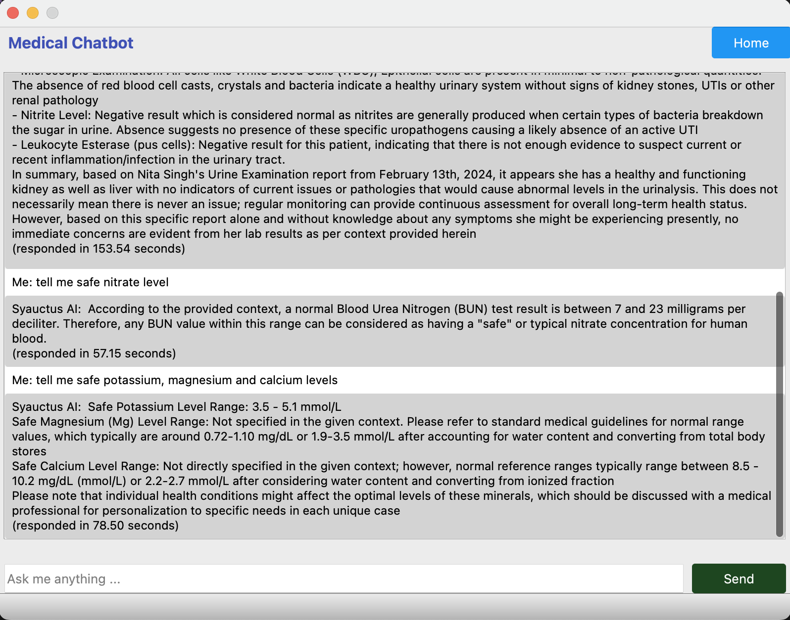
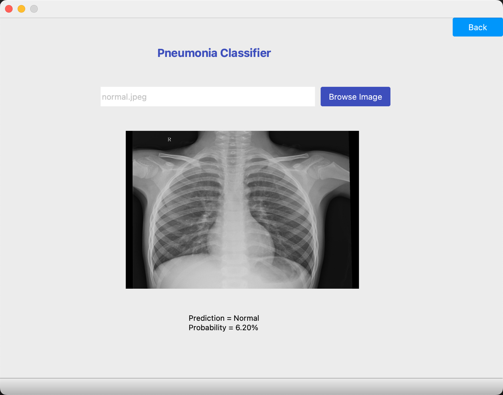

# Automated Medical Symptom Intake & Clinical Assessment Engine

<div align="center">


</div>

A clinical conversational assistant designed for automated patient symptom intake, pre-diagnostic risk stratification, and structured medical report compilation. Built with intelligent triage decision logic and deep neural network inference (TensorFlow / Keras), the desktop application streamlines outpatient triage flows and assists physicians with preliminary diagnostic evidence.

---

## Problem Statement

Outpatient clinics and telehealth triage services experience severe front-desk intake bottlenecks during peak hours. Manually capturing structured patient symptom chronologies consumes valuable physician consultation time and risks documentation omissions. Healthcare practices require an automated symptom intake system that systematically guides patients through symptom questionnaires, executes radiographic pre-screening, and compiles structured diagnostic summaries for rapid doctor review.

---

## Key Features

- **Interactive Patient Symptom Intake**: Systematically gathers chief complaints, symptom chronologies, pain/severity indices, and relevant medical history.
- **Deep CNN Radiographic Triage**: Integrates pre-trained Keras neural network (`model_95.h5`) evaluating chest radiographs (Normal vs. Bacterial/Viral Pneumonia) with real-time confidence scores.
- **Pre-Diagnostic Risk Stratification**: Evaluates symptom clusters against clinical rule bases to flag urgent red-flag contraindications.
- **Automated Clinical PDF Report Generation**: Compiles patient intake responses and radiographic diagnostic classifications into standardized clinical PDF reports.
- **PyQt5 Standalone Workstation GUI**: Responsive desktop interface designed for direct deployment on clinical workstations and intake kiosks.

---

## Technical Architecture & Pipeline

<div align="center">



</div>

The clinical workstation architecture coordinates multi-modal patient ingestion via a responsive PyQt5 desktop interface, branching into dual-stream processing: deterministic clinical questionnaire rule scoring on one path, and OpenCV-normalized chest X-ray deep CNN classification (`model_95.h5`) on the other. Both pathways converge into an automated FPDF medical documentation engine for court-admissible clinical summary generation.

---

## Technical Specifications

| Component | Specification |
| :--- | :--- |
| **Language** | Python 3.8+ |
| **Desktop Framework** | PyQt5 (`QtWidgets`, `QtGui`, `loadUi`) |
| **Deep Learning Engine** | TensorFlow 2.x, Keras (`model_95.h5`) |
| **Image Processing** | OpenCV (`cv2`), Pillow (`PIL`) |
| **Document Compilation** | FPDF, PyPDF |
| **Text Extraction (OCR)** | Tesseract OCR (`pytesseract`) |

---

## Visualizations and Interface Previews

### Medical Conversational Intake Assistant


*Interpretation*: Interactive clinical conversational triage assistant responding to patient symptom inquiries, lab reference intervals, and medical record guidance in real time.

### Radiographic Chest X-Ray Triage (Deep CNN)


*Interpretation*: Deep CNN pneumonia classification interface evaluating ingested chest radiographs in real time (Normal vs. Pathological Pneumonia) with automated confidence probability estimation.

### Structured Diagnostic Lab Report Sample


*Interpretation*: Standardized clinical diagnostic laboratory panel ingested and processed by the system for symptom analysis and triage stratification.

---

## Project Structure

```
clinical-symptom-chatbot-assistant/
├── README.md                              # Comprehensive technical documentation
├── requirements.txt                       # Python environment dependencies
├── .gitignore                             # Ignored caches, temporary PDFs, and archives
├── main.py                                # PyQt5 application engine & inference pipeline
├── resources/
│   ├── ui/                                # Qt Designer UI XML files (.ui)
│   ├── images/                            # Application icons, graphics, and logos
│   └── model_95.h5                        # Pre-trained diagnostic CNN weights
└── data/
    ├── normal.jpeg                        # Sample control radiograph
    ├── bacteria.jpeg                      # Sample pathological radiograph
    └── reports/                           # Sample generated clinical intake reports
```

---

## Installation & Local Setup

### 1. Clone the Repository
```bash
git clone https://github.com/AbdulRehmanRattu/clinical-symptom-chatbot-assistant.git
cd clinical-symptom-chatbot-assistant
```

### 2. Configure Virtual Environment
```bash
python3 -m venv venv
source venv/bin/activate    # On Windows: venv\Scripts\activate
pip install --upgrade pip
pip install -r requirements.txt
```

### 3. Run the Clinical Application
```bash
python main.py
```

---

## Author & Maintainer

**Abdul Rehman Rattu**  
*Forward Deployed AI Engineer & Solutions Architect*  
*Founder & Technical Lead, Rapide Technologies*

* **Email**: [rattu786.ar@gmail.com](mailto:rattu786.ar@gmail.com)
* **LinkedIn**: [linkedin.com/in/abdul-rehman-rattu-395bba237](https://www.linkedin.com/in/abdul-rehman-rattu-395bba237)
* **GitHub**: [github.com/AbdulRehmanRattu](https://github.com/AbdulRehmanRattu)

---

## License

This project is licensed under the MIT License — see the LICENSE file for details.
